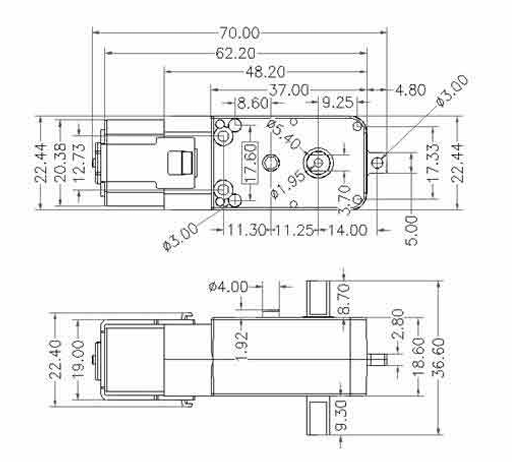
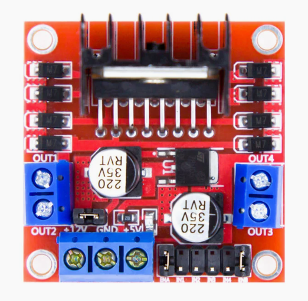
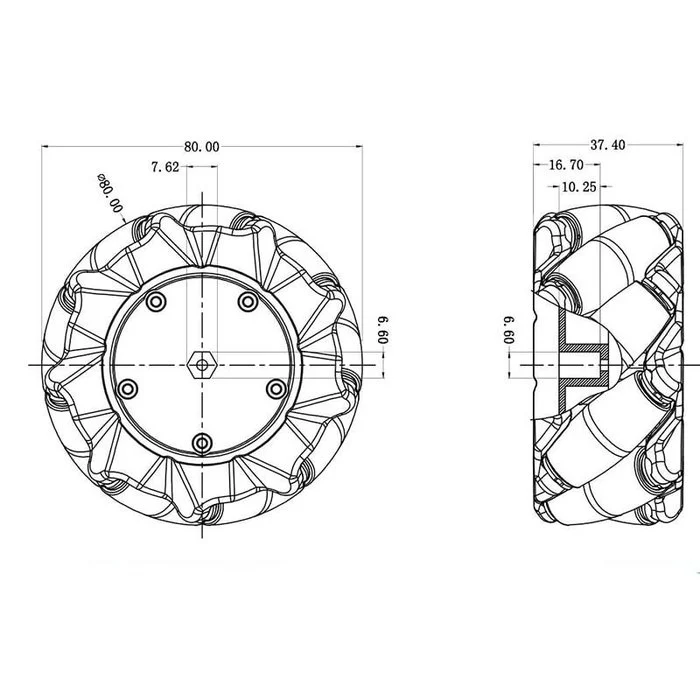
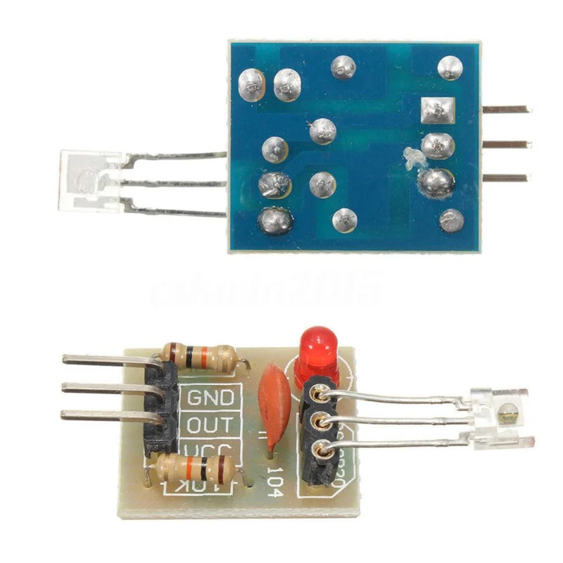
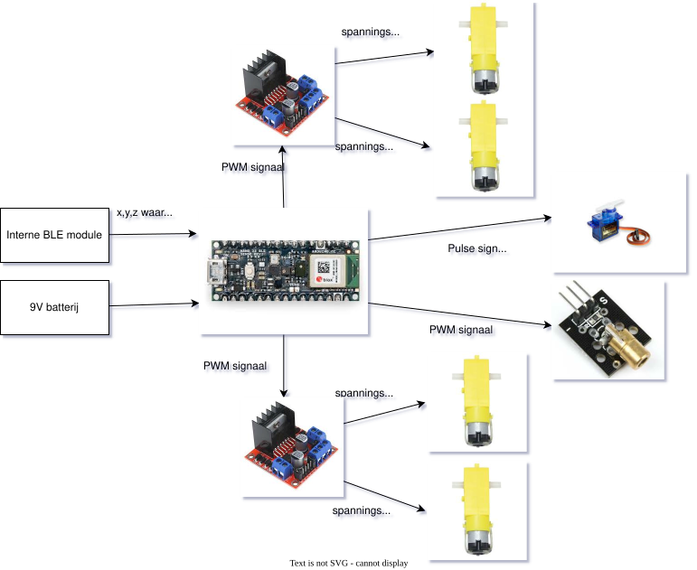
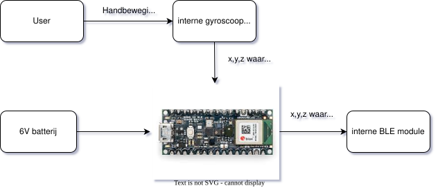

# Documentation

Deze map bevat documentatie en specificaties voor het project.

## BOM

Hieronder staat de Bill of Materials (BOM) voor het project:

| Component         | Prijs/stuk | Aantal | Totaalprijs | Opmerking               | Link naar component                |
|-------------------|------------|--------|-------------|-------------------------|------------------------------------|
| Arduino Nano 33 BLE Sense Rev2 with Headers       | €44,15     | 2      | €88,30     | Microcontroller met gyroscoop en bluetooth         | [kiwi](https://www.kiwi-electronics.com/en/arduino-nano-33-ble-sense-rev2-with-headers-11207?srsltid=AfmBOorEKgNR_dinSSKnJzBCy2cwIM_K1HHhxGHojLlitCHDhjyoVGH4) |
| mecanum wielen (2 stuks)    | €13,00    | 2      | €26,00     | Wielen voor omnidirectionele beweging | [otronic](https://www.otronic.nl/nl/mecanum-wiel-omnidirectioneel-wiel-80mm-a-geel-set.html) |
| McNamum wielkoppeling | €4,40     | 4      | €17,60      | Koppeling voor mecanum wielen | [otronic](https://www.otronic.nl/nl/67mm-mcnamum-wielkoppeling-met-m2530-schroef.html) |
| TT-motor | €2,00     | 4      | €8,00      | Motor voor aandrijving van de wielen | [otronic](https://www.otronic.nl/nl/tt-motor-voor-aandrijving-wielen-dubbele-as.html) |
| L298N motor driver | €2,60     | 2      | €5,20      | Motor driver voor het aansturen van de TT-motoren | [otronic](https://www.otronic.nl/nl/l298n-motor-driver-board-rood.html) |
| 9V batterijhouder | €1,50     | 1      | €1,50      | Batterijhouder voor 9V batterij | [otronic](https://www.otronic.nl/nl/9v-batterijhouder-met-aan-uit-tuimelschakelaar-9-v.html) |
| 6V batterijhouder | €0,95     | 2      | €1,90      | Batterijhouder voor 4 AA batterijen (6V) | [otronic](https://www.otronic.nl/nl/4x-aa-batterijhouder-6v.html) |
| servomotor SG90 micro | €4,15     | 1      | €4,15      | Servomotor voor kannon op en neer | [otronic](https://www.otronic.nl/nl/servo-sg90-micro-180-graden.html?source=googlebase&gad_source=1&gad_campaignid=19639985996&gbraid=0AAAAACZK5qt2WCV4nNg-E26CpEE2x9rUz&gclid=CjwKCAjwup3HBhAAEiwA7euZuk2WwIJDgAclXEV5tnT1Aj656PHRDnFzcf_AuOX2mFILzhPvTrnJZBoCsQ8QAvD_BwE) |
| lasertransmitter | €1,20     | 1      | €1,20      | Lasertransmitter voor kannon | [otronic](https://www.otronic.nl/nl/laser-diode-5v-module-rode-laser-650nm-5mw-koperen.html) |
| laser ontvanger | €1,95     | 1      | €1,95      | Laser ontvanger voor target | [otronic](https://www.otronic.nl/nl/5v-ontvanger-module-voor-laser-diode.html?source=googlebase&gad_source=1&gad_campaignid=19639985996&gbraid=0AAAAACZK5qt2WCV4nNg-E26CpEE2x9rUz&gclid=CjwKCAjwup3HBhAAEiwA7euZuiG-O_8Bph6YO7Qr4fJCEoCmUfKjolpxiwBfOWCFe0IP3KCnW2P0xhoCoPUQAvD_BwE) |
| arduino nano | €6,80     | 1      | €6,80      | Microcontroller voor de target | [otronic](https://www.otronic.nl/nl/nano-v3-arduino-compatible-ch340-voorgesoldeerd.html?source=googlebase&gad_source=1&gad_campaignid=19639985996&gbraid=0AAAAACZK5qt2WCV4nNg-E26CpEE2x9rUz&gclid=CjwKCAjwup3HBhAAEiwA7euZuuQCWR5InQhULsq2bEmu5rOgdqvDIouzecjb0gOtY7eFn1gCphPufxoCwbwQAvD_BwE) |
| PLA filament | €22,99 | 2 | €45,98 | Voor het 3D printen | [bambu](https://eu.store.bambulab.com/nl/products/pla-basic-filament?srsltid=AfmBOopzl8Ui3SRX1asf7fv3_W_GNpjsnPVJk0DaR7XjuCmrnf9uU5jH&id=43992830017755) |

De totaalprijs van alle componenten is: €162,60

## Componenten

Hieronder wat meer informatie over de gebruikte componenten:

### Arduino Nano 33 BLE Sense Rev2 with Headers

De Arduino Nano 33 BLE Sense Rev2 is een compacte  microcontroller vergelijkbaar met de standaard Arduino Nano, maar met extra functionaliteit. De microcontroller bevat een ingebouwde gyroscoop dat we gebruiken voor de bewegingsdetectie van de handcontroller. Daarnaast heeft de microcontroller bluetooth functionaliteit waarmee we draadloos kunnen communiceren tussen de handcontroller en de auto.

### TT-motor

De TT-motor is een kleine, goedkope en efficiënte motor die vaak wordt gebruikt in robotica en kleine voertuigen. In ons project gebruiken we de TT-motoren om de mecanum wielen aan te drijven.

### L298N motor driver

De L298N motor driver is een motor driver die we gebruiken om de TT-motoren aan te sturen. De motor driver kan twee DC-motoren tegelijk aansturen en kan zowel de snelheid als de draairichting van de motoren regelen.

### Mecanum wielen

Mecanum wielen zijn speciale wielen die omnidirectionele beweging mogelijk maken. Dit betekent dat het voertuig in elke richting kan bewegen zonder van richting te veranderen. Dit wordt bereikt door de unieke constructie van de wielen, die bestaan uit meerdere rollers die onder een hoek zijn geplaatst.

### Servomotor SG90 micro

De SG90 is een kleine en lichte servomotor die vaak wordt gebruikt in modelbouw en robotica. In ons project gebruiken we de SG90 servomotor om het kannon van de auto omhoog en omlaag te bewegen.

### Lasertransmitter en ontvanger

De lasertransmitter zendt een laserstraal uit die wordt gebruikt als projectiel in ons lasershooterspel. De laser ontvanger detecteert wanneer de laserstraal wordt geraakt, wat wordt gebruikt om te bepalen of een doelwit is getroffen.

### Arduino nano

De Arduino Nano is een kleine, veelzijdige microcontroller die we gebruiken in de target van ons lasershooterspel. Het is verantwoordelijk voor het detecteren van hits van de laserstraal en het bijhouden van de score.

## Idee kannon en target

### Kannon

Het idee dat we hebben voor het kannon is om een servomotor op de tank te plaatsen die het kannon omhoog en omlaag kan bewegen. Op het kannon is een lasertransmitter gemonteerd die een laserstraal uitzendt wanneer het kannon wordt afgevuurd. De lasertransmitter wordt aangestuurd door de Arduino Nano 33 BLE Sense Rev2 op de handcontroller en de servomotor ook. De besturing via de handcontroller zou nog steeds hetzelfde zijn maar we voegen een extra knop toe om te wisselen tussen rijden en turret modus. In turret modus kan de gebruiker het kannon omhoog en omlaag bewegen met behulp van de gyroscoop in de handcontroller, ook kan de gebruiker de tank laten draaien rond zijn eigen as. De laser gaat aan zodra de wagen in turret modus wordt geschakelt.

### Target

Het target bestaat uit een Arduino Nano die is verbonden met een laser ontvanger module. De laser ontvanger detecteert wanneer de laserstraal van het kannon het target raakt. Wanneer een hit wordt gedetecteerd, stuurt de Arduino Nano een signaal naar een LED of een buzzer om aan te geven dat het target is geraakt. Daarnaast kan de Arduino Nano ook de score bijhouden en deze weergeven op een klein LCD-scherm.

## Introductieposter

[Hier](./Introductieposter/introductieposter.md) kan je de introductieposter vinden van ons project.

## Architectuur document

Hieronder staan de architectuur documenten voor het project.

### Architectuur van de auto

### Architectuur van de handcontroller

  

## Prototypes

In de map [afbeeldingen](./Afbeeldingen/) kan je enkele foto's vinden van enkele prototype's. Er is een afbeelding te vinden van een amazon variant waar onze eigen rc wagen op gebaseerd is. Er zijn ook schetsen te vinden over hoe we componenten plaatsen op onze rc wagen (ook te afmetingen zijn hierop te vinden). Verder zijn er afbeeldingen te vinden genaamd 3d_tank en 3d_handcontroller, deze tonen eerdere versies van de uiteindelijke tank en handcontroller.

## Mechanisch ontwerp

Hier komt hoe we alles zullen bevestigen in de tank / rc wagen.
Er is een inkeping in de 3D print van de grondplaat, de vier motoren en alle andere componenten worden hier in bevestigd. De vier motoren worden vastgemaakt met lijm zodat vermeden wordt dat deze nog kunnen bewegen. Beide driver boards zitten vast met twee bouten en moeren voor extra stevigheid.

### Mogelijke opties voor het bevestigen van de servomotor en laser transmitter

1. Servomotor bevestigen aan de 3D print met lijm, laser transmitter bevestigen aan de servo-arm ook met lijm.
2. Servomotor bevestigen via schroeven (indien mogelijk) aan de 3D print, hier moet er dan ook rekening mee gehouden worden in de 3D print. De laser transmitter bevestigen aan de arm met schroeven als dit een mogelijkheid is.
3. 3D geprint houdertje voor zowel de servomotor als voor de laser transmitter. Als we deze optie kiezen moet de 3D print van de kop opnieuw gedesigned worden.

⬅️ [Terug naar overzicht](../README.md#Inhoud)