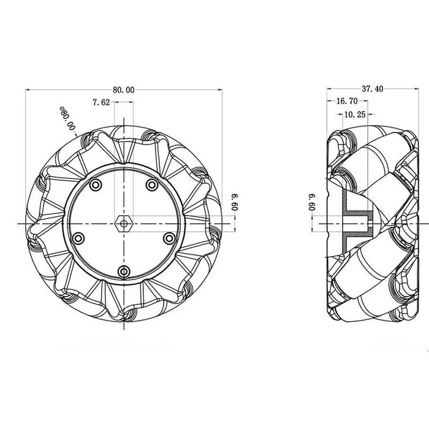
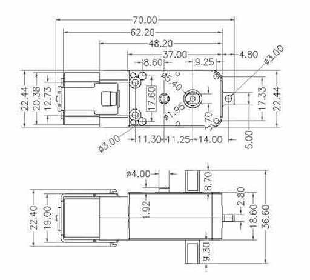
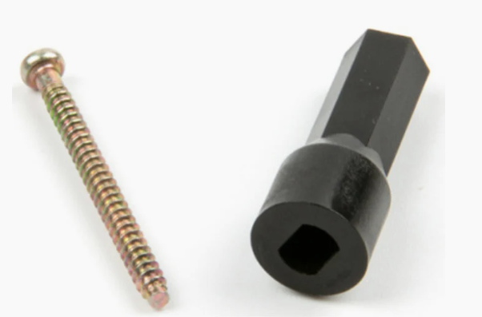
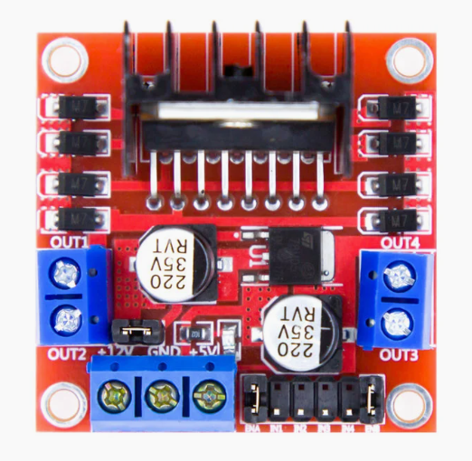

# Afmetingen 

## Mecanum wielen

Lengte: 8cm  
Breedte: 3,74cm  
Hoogte: 8cm

## Motors

Lengte: 7cm  
Breedte: 3,66cm  
Hoogte: 2,2cm

## Wielkoppeling en schroef

Wielkoppeling: 0,67cm  
Schroef: M2.5 x 0,3cm

## Motor driver

Lengte: 4,3cm   
Breedte: 4,3cm  
Hoogte: 2,7cm  

