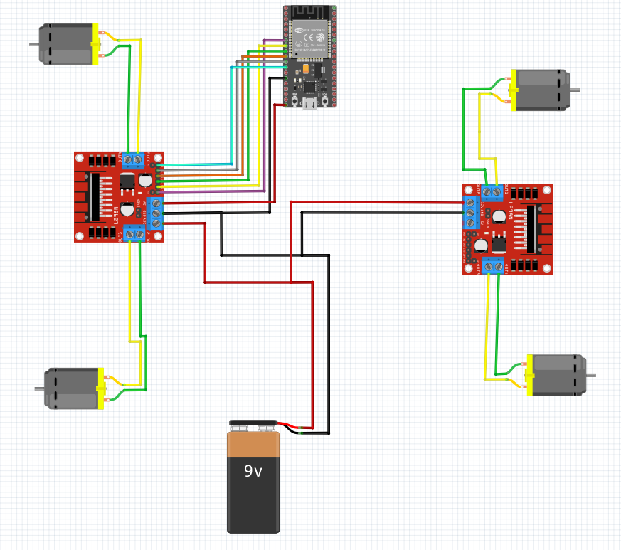

# De hardware van de auto

### Auto:
1. Arduino Nano 33 BLE Sense Rev2
2. 2x L298N motor driver
3. 4x TT-Motor
4. 9V Batterij

*Figuur: Elektrisch schema van de auto met ESP32 (moet normaal Arduino Nano 33 BLE Sense REV2).*

### Tank gedeelte:
1. Servo SG90 Micro
2. Laser diode 

