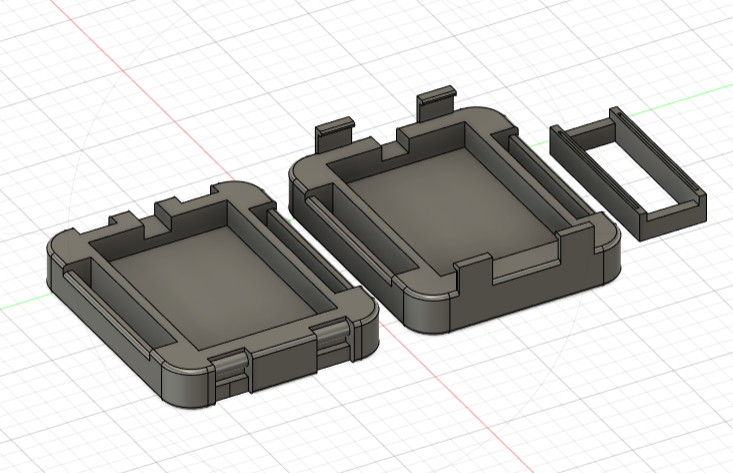
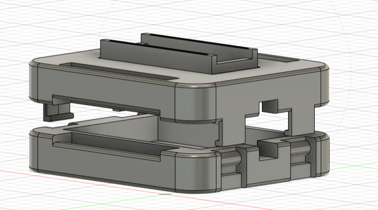

# Handcontroller

De hand controller bestaat uit twee onderdelen: fysiek en elektronica.

## Fysiek

Het fysiek onderdeel bestaat uit vijf componenten: 
- Housing bodemplaat (gehold)
- Housing bovenplaat (gehaakt)
- Housing arduino gleuf
- Pols strap (gaten)
- Pols strap (haken)

De housing-componenten kunnen worden afgeprint a.d.h.v. de .stl-files, gevonden in de submap van de huidige folder.
De pols straps zijn gerecycleerd uit de hand controller van een chinees speelgoed autotje gedoneerd door Mnr. Calleeuw.

## Elektronica

Het elektronica onderdeel bestaat uit drie componenten:
- Microcontroller Arduino Nano 3.3V BLE
- 3xAAA batterijhouder (incl. 3xAAA batterijen)
- Luskoppen voor elektrische draden

## Assemblage

De binnenkant van de twee housing platen beschikken over een holte waarin de 3xAAA batterijhouder past, alsook een zijdelingse holte waardoor de bedrading van de batterijhouder kan worden gestoken om uit de housing te geraken. Bemerkt dat de bovenplaat extra plaats overhoudt in de holte voor de draden, terwijl de bodemplaat dat niet doet om de batterijhouder vanbinnen vast te houden.

> Plaats de batterijhouder met batterijen in de holte van de bodemplaat, met de bedrading door de zijdelingse holte.

Aan de lange zijdes van de platen zijn gleuven voorzien voor de koppen van de pols straps. Afhankelijk van of de gebruiker zijn of haar linker- of rechterhand wild gebruiken, kunnen deze straps omgewisseld worden.

> Plaats de koppen van de pols straps in de gleuven.

> Klik de bovenplaat vast in de bodemplaat om de batterijhouder en pols straps vast te zetten. Extra aandacht dat de bedrading niet dubbel komt te zitten.

Bovenop de bovenplaat is er een holte voorzien voor de arduino gleuf.

> Plaats de arduino gleuf in de holte op de bovenplaat en zet deze vast met lijm. Extra aandacht de gleuven niet te buigen.

De luskoppen voor de bedrading dienen voor gemakkelijke vastmaking op de corresponderende pinnen op de arduino, zie hier: [Hand Controller Fysieke Onderdelen](handControllerCircuitv2.png)

> Voorzie de bedarding van luskoppen, en maak deze vast aan de juiste pinnen van de arduino.

> Schuif de arduino in de gleuf zodat de luskoppen vast komen te zitten tussen de arduino en de gleuf. Extra aandacht dat de arduino goed vastzit in de gleuf.