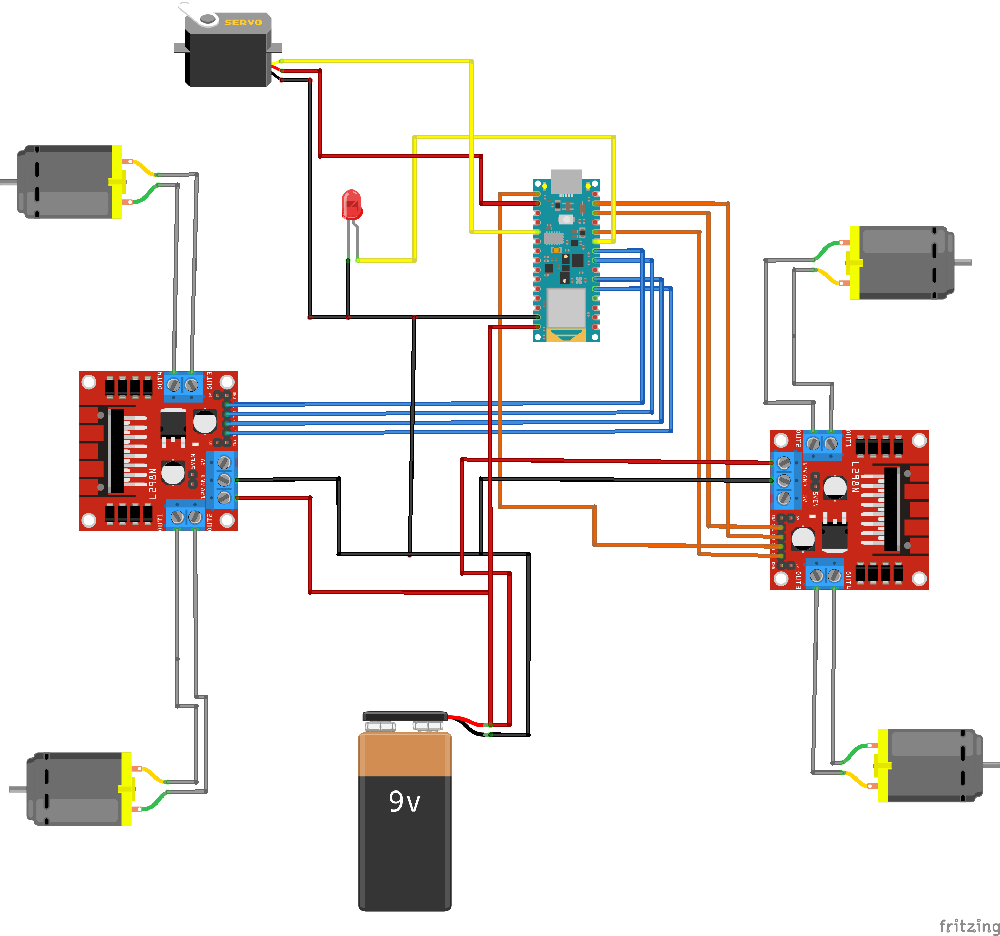
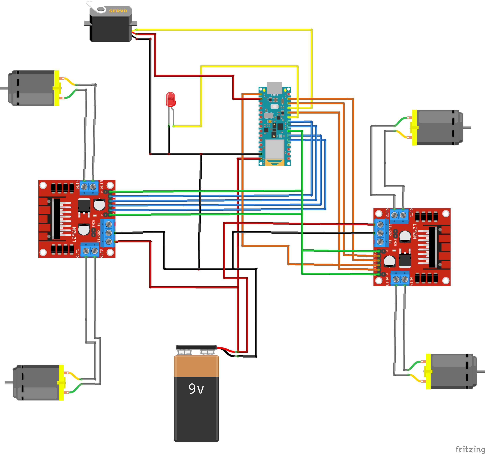
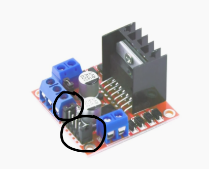
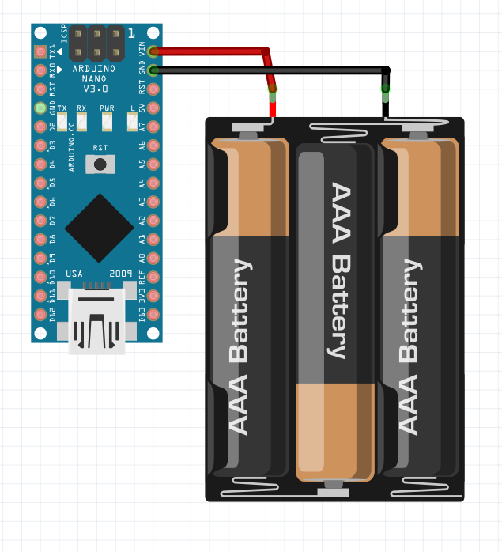
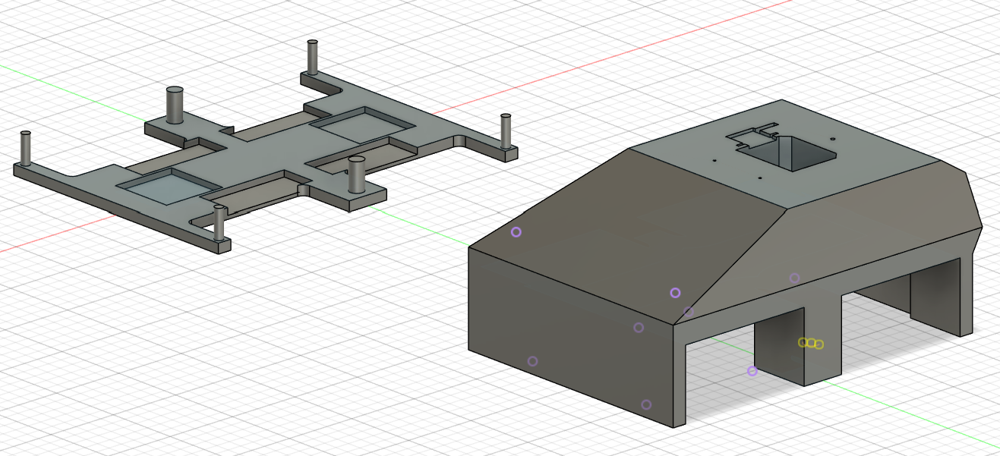
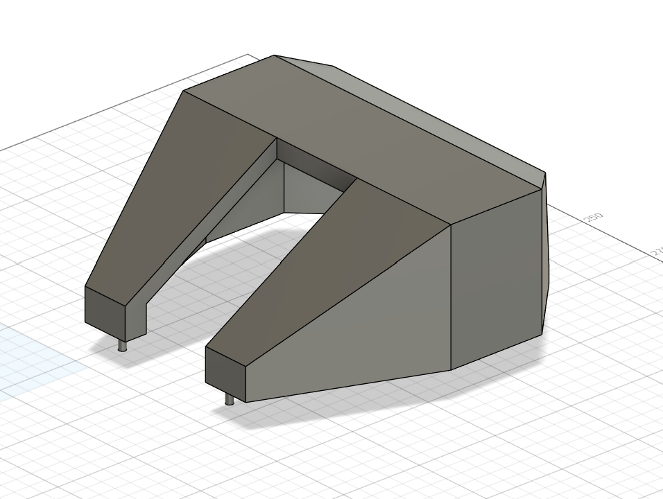
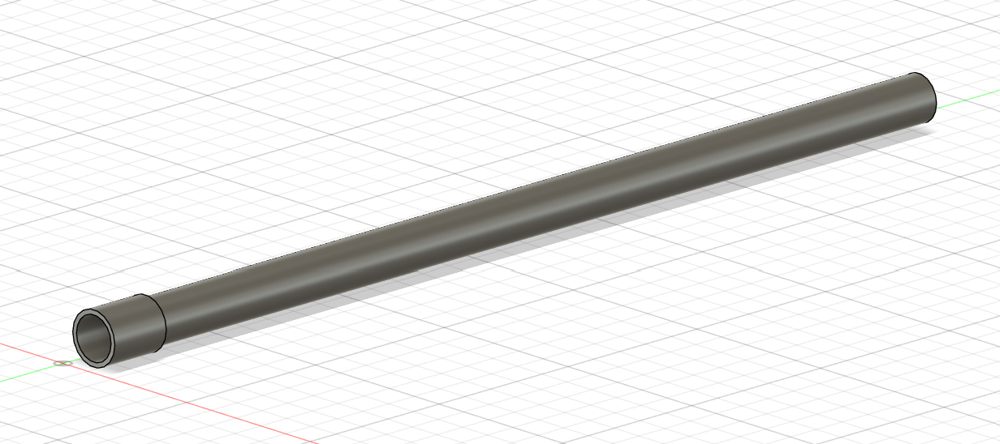
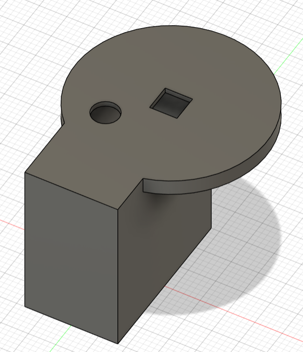

# Hardware

Deze map bevat alle hardware componenten en schema's voor het project.

## Inhoud

1. [De hardware van de auto](#de-hardware-van-de-auto)
2. [Hand Controller](#hand-controller)
3. [Tank](#tank)
3. [Target](#target)

## De hardware van de auto

### Auto

1. Arduino Nano 33 BLE Sense Rev2
2. 2x L298N motor driver
3. 4x TT-Motor
4. 7.4V Traxxas Batterij
5. Servo SG90 Micro 
6. Laser diode

### Tank gedeelte

1. Servo SG90 Micro
2. Laser Diode Transmitter

### Elektrische schema's

Er is de mogelijkheid om te kiezen tussen twee schakelingen na gelange de code die je gebruikt.

1. Vaste snelheidsregeling: De auto hanteert een constante snelheid zodra er input wordt gegeven. Door het verminderde aantal benodigde signaalkabels blijft er capaciteit op de microcontroller over voor extra sensoren of modules.

*Figuur: Elektrisch schema van de auto met Arduino Nano 33 BLE Sense REV2: Vaste snelheidsregeling*

2. Variabele snelheidsregeling: Hierbij zijn alle motoren aangesloten op 1 snelheids regeling Pin. Dit zorgt er voor dat je alle motoren samen kunt versnellen of vertragen. Dit word bij ons gebruikt om in "tank mode" rond te draaien zodat de tank niet te snel draaid.

*Figuur: Elektrisch schema van de auto met Arduino Nano 33 BLE Sense REV2: Variabele snelheidsregeling*

Om bovenstaande schema na te maken moet je 2 connector pinnen op de H-bruggen verwijderen. Zie foto hieronder.

### Schema Lazer 

Helaas stuurt de Arduino Nano 33 BLE Rev2 maar 3,3V signaalen uit en heeft de laze zelf 5V nodig. Met 3,3V is deze lazer niet fel genoeg. Hiervoor moesten we nog een schakeling voorzien.

## Hand Controller

### Concept

De hand controller is de intuïtieve/immersive interface voor de besturing van de RC-car, met uitbreiding van een IR-turret.

### Kern

De controller maakt gebruik van een Arduino Nano 33 BLE Sense Rev2. Deze microcontroller werd gekozen vanwege:

1. Inertial Measurement Unit (IMU): De interne accelerometer en gyroscoop lezen de pitch (voor/achterwaartse kanteling) en de roll (zijwaartse kanteling) data om de oriëntatie van de hand in real-time te bepalen.
2. Bluetooth Low Energy (BLE) Module: Voor draadloze communicatie met de RC-car.
3. Magic Wand/Tensorflow Gesture Recognition als uitbreiding. Laat toe te schakelen tussen verschillende modussen of functies van de controller zonder extra knoppen te monteren/de andere hand te moeten gebruiken.

### Montage

De Arduino wordt gemonteerd op een 3D-geprintte palm-bracelet dat ook de 3x AAA batterijhouder power supply huist. Zie de .stl-files voor meer info.

### Besturing

De bewegingsdata van de IMU wordt in de Arduino firmware vertaald naar digitale bewegingscommando's en verzonden naar de RC-car.

| Modus | IMU Data | Commando |
| :--- | :--- | :--- |
| Car | Kantelen naar voren | Rijden vooruit |
| Car | Kantelen naar achteren | Rijden achteruit |
| Car | Kantelen naar links | Rijden links |
| Car | Kantelen naar rechts | Rijden rechts |
| Turret | Kantelen naar links | Car roteert op as links |
| Turret | Kantelen naar rechts | Car roteert op as rechts |
| Turret | Kantelen naar voren | Turret mikt hoger (servo) |
| Turret | Kantelen naar achteren | Turret mikt lager (servo) |

### Turret Modus

A.d.h.v. Gesture Recognition kan de user schakelen tussen verschillende modussen.
In Turret Modus veranderd de interpretatie van de IMU-data:

Zijwaartse kanteling wordt gebruikt om de car op zijn vaste as te laten roteren, zoals in tank-besturing.
De voor- en achterwaartse kanteling wordt gebruikt om een servomotor in de turret aan te sturen. Deze servo is verantwoordelijk voor de elevatie van een gemonteerde IR-laser.

### IR-Laser

De eerdervernoemde drukknop die de modus schakelt heeft een secundaire functie, namelijk de IR-laser aan of uit schakelen, waarbij deze in de Turret Modus aanstaat.
Dit voorkomt dat de laser onbedoeld aanblijft.

### Onderdelen Hand controller
1. Arduino Nano 33 BLE Sense REV2

2. 3x AAA batterijhouder

3. Bracelet behuizing en straps

#### Schema:

### STL

Alle STL files voor het ontwerp van de handcontroller die gebruikt werden tijdens dit project zijn te vinden in deze [map](./Handschoen/STL_files/).

## Tank

### Previews

De RC tank is gemaakt uit vier verschillende onderdelen, zijnde het chassis van de tank, de carosserie, de kop en een loop. 

Het chassis is gedesigned zodat er plaats voorzien is voor de vier motoren, alsook plaats voor twee driver boards. Verder zijn er kleine pinnen voorzien op het chassis zodat de carosserie er op bevestigd kan worden.

Op de bovenkant van de carosserie is er plaats voorzien voor de servo-motor met ook een gat voor bekabeling. Daarnaast zijn er gaten aan de onderkant zodat de carosserie op het chassis past. Aan de bovekant zijn er gaten voorzien voor het bevestigen van de kop.

In de kop is er een gat voorzien om de loop door te steken.
Ook zijn er pinnen voorzien aan de onderkant voor de montage op de carosserie.

### STL

Alle STL files voor het ontwerp van de tank die gebruikt werden tijdens dit project zijn te vinden in deze [map](./Tank/STL_files/).

## Target

De target bevat een [Laser-receiver](https://www.otronic.nl/nl/5v-ontvanger-module-voor-laser-diode.html)

 

We hebben hiervoor een behuizing gemaakt die dan de target zal voorstellen

⬅️ [Terug naar overzicht](../README.md#Inhoud)

