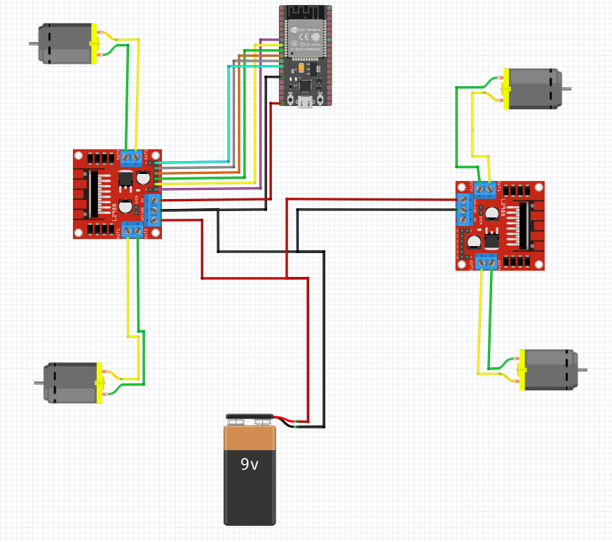

# Hardware

Deze map bevat alle hardware componenten en schema's voor het project.

## inhoud

1. [De hardware van de auto](#de-hardware-van-de-auto)
2. [Handschoen Controller](#handschoen-controller)

## De hardware van de auto

### Auto

1. Arduino Nano 33 BLE Sense Rev2
2. 2x L298N motor driver
3. 4x TT-Motor
4. 9V Batterij

*Figuur: Elektrisch schema van de auto met ESP32 (moet normaal Arduino Nano 33 BLE Sense REV2).*

### Tank gedeelte

1. Servo SG90 Micro
2. Laser diode

## Handschoen Controller

### Concept

De handschoen controller is de intuïtieve/immersive interface voor de besturing van de RC-car, met uitbreiding van een IR-turret.

### Kern

De controller maakt gebruik van een Arduino Nano 33 BLE Sense Rev2. Deze microcontroller werd gekozen vanwege:

1. Inertial Measurement Unit (IMU): De interne accelerometer en gyroscoop lezen de pitch (voor/achterwaartse kanteling) en de roll (zijwaartse kanteling) data om de oriëntatie van de hand in real-time te bepalen.
2. Bluetooth Low Energy (BLE) Module: Voor draadloze communicatie met de RC-car.

### Montage

De Arduino wordt gemonteerd op de rug van een handschoen, best op een buigzaam stuk kurk of een vergelijkbaar licht/isolerend/vervormbaar/comfortabel materiaal.

### Besturing

De bewegingsdata van de IMU wordt in de Arduino firmware vertaald naar digitale bewegingscommando's en verzonden naar de RC-car.

| Modus | IMU Data | Commando |
| :--- | :--- | :--- |
| Car | Kantelen naar voren | Rijden vooruit |
| Car | Kantelen naar achteren | Rijden achteruit |
| Car | Kantelen naar links | Rijden links |
| Car | Kantelen naar rechts | Rijden rechts |
| Turret | Kantelen naar links | Car roteert op as links |
| Turret | Kantelen naar rechts | Car roteert op as rechts |
| Turret | Kantelen naar voren | Turret mikt hoger (servo) |
| Turret | Kantelen naar achteren | Turret mikt lager (servo) |

### Drukknop

Een drukknop wordt op de Arduino gemonteerd en dient als een toggle/schakelaar tussen de modussen.

1. Car Modus: Controller stuurt de mobiliteit van de car.
2. Turret Modus: Controller stuurt de vector van de turret en draait de auto.

### Turret Modus

In Turret Modus veranderd de interpretatie van de IMU-data:

Zijwaartse kanteling wordt gebruikt om de car op zijn vaste as te laten roteren, zoals in tank-besturing.
De voor- en achterwaartse kanteling wordt gebruikt om een servomotor in de turret aan te sturen. Deze servo is verantwoordelijk voor de elevatie van een gemonteerde IR-laser.

### IR-Laser

De eerdervernoemde drukknop die de modus schakelt heeft een secundaire functie, namelijk de IR-laser aan of uit schakelen, waarbij deze in de Turret Modus aanstaat.
Dit voorkomt dat de laser onbedoeld aanblijft.

## Kalibratie

TBA
